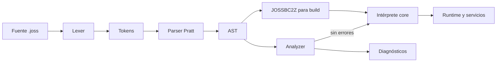

# Arquitectura del lenguaje Joss

[Índice](README.md) · Antes: [estado](ESTADO_IMPLEMENTACION.md) · Después: [contribuir](CONTRIBUIR.md)

## Pipeline real

```text
fuentes .joss
  → lexer (`pkg/parser/lexer.go`)
  → parser Pratt (`pkg/parser`)
  → AST (`pkg/parser/ast*.go`)
  → análisis semántico (`pkg/analyzer`)
  → diagnósticos (`pkg/diagnostics`)
  → intérprete AST (`pkg/core/evaluator*.go`, `executor.go`)
  → runtime integrado (`pkg/core`, `pkg/server`)
```



`joss analyze` conserva cada archivo como una `analyzer.SourceUnit`; no concatena ASTs perdiendo el origen. Primero registra declaraciones globales de funciones y clases, después analiza cada método con un scope léxico independiente. Las clases nativas provienen de `Runtime.RegisterNativeClasses`; los plugins aportan sus índices de símbolos JP v2.

## Responsabilidades

| Paquete | Responsabilidad |
|---|---|
| `pkg/parser` | Tokens, lexer, precedencias, parser y nodos AST. |
| `pkg/typesystem` | Nombres canónicos, inferencia, coerción explícita y compatibilidad de asignación. |
| `pkg/analyzer` | Unidades fuente, scopes, símbolos, inferencia de expresiones, firmas y flujo alcanzable. No depende del runtime. |
| `pkg/diagnostics` | Modelo común: código, severidad, mensaje, archivo, rango, explicación y sugerencia. |
| `pkg/core` | Adaptación de catálogos reales al analizador, intérprete y primitivas integradas. |
| `pkg/runtime/errors` | Error runtime estructurado y frames de stack Joss, sin dependencias de framework. |
| `pkg/runtime/value` | Semántica de valores independiente del evaluator, incluida indexación Unicode. |
| `pkg/runtime/plan`, `pkg/runtime/frame` | Planes de callables, slots y representación etiquetada usados para acelerar resolución local; no forman bytecode portable. |
| `pkg/pluginruntime`, `pkg/pluginpkg` | Carga aislada, verificación y resolución de símbolos de plugins JP v2. |
| `pkg/bytecode` | Serialización comprimida del AST. No es código máquina ni LLVM IR. |
| `pkg/vm` | Compilador/VM experimental independientes. El CLI y `pkg/core` no los usan como ruta predeterminada. |
| `cmd/joss` | CLI, análisis de proyecto, ejecución, build y administración. |
| `vscode-joss` | LSP/editor. Consume el catálogo generado del núcleo. |

## Fuentes de verdad

- Keywords: `pkg/parser/token.go`; `parser.KeywordNames()` es la proyección para tooling.
- Tipos y compatibilidad: `pkg/typesystem`.
- Built-ins globales: nombres en `pkg/core/builtins.go`, retornos en `pkg/core/native_signatures.go`. El dispatcher rechaza nombres fuera del catálogo.
- Clases/métodos nativos: llamadas a `registerNative` dentro de `Runtime.RegisterNativeClasses()`; sus retornos se tipan en `pkg/core/native_signatures.go`.
- Símbolos de plugins: `pluginpkg.SymbolIndex` incluido en cada `.jp`.
- Diagnósticos: `pkg/diagnostics.Diagnostic` y códigos emitidos por `pkg/analyzer`.
- Catálogo de VS Code: `vscode-joss/src/server/generated/languageCatalog.json`, generado mediante `go run ./tools/cataloggen`.

CI ejecuta `go run ./tools/cataloggen --check`; editar a mano el catálogo generado no es válido.

## Scopes y símbolos

- Cada función, método, `Init` y closure tiene un scope propio.
- Los parámetros pertenecen únicamente a su callable.
- Los bloques de control usan el scope del callable para reflejar el runtime actual.
- El binding de `foreach` puede reutilizarse en otro loop; el runtime lo trata como asignación.
- Las clases y funciones top-level se resuelven a nivel de proyecto.
- Los globals nativos y símbolos de plugins se inyectan mediante `analyzer.Environment`.
- Una función con nombre no hereda variables fuente del caller ni variables top-level: recibe parámetros, locales, `this` y bindings del host/plugin. Una closure sí captura léxicamente.
- Los parámetros requieren tipo explícito; `mixed` nunca se introduce silenciosamente.
- Un parámetro `ref` recibe un alias temporal al binding mutable del caller. Analyzer y runtime exigen marca bilateral, l-value, no-constancia y tipo exactamente invariante.
- La visibilidad no tiene default: parser, analyzer y runtime conservan y validan `public`, `private` y `protected`.

## Build y ejecución

El modo de desarrollo interpreta el AST. Cada invocación de callable crea un frame léxico independiente; no existe scope dinámico entre caller y callee. Esto evita que una llamada recursiva lea o sobrescriba locales del caller. El runtime limita la profundidad a 1024 frames por defecto y las closures escriben únicamente sobre su entorno capturado. Los tipos de retorno anotados se validan en analyzer/runtime y el analyzer exige terminación exhaustiva demostrable.

Antes de ejecutar un callable, `pkg/runtime/plan` puede asignar slots a parámetros
y locales. `frame_runtime.go` usa esos slots y conserva un fallback para bindings
que no caben en el plan. Metadatos de clase, accesos y scopes se cachean; cualquier
cambio semántico debe comparar la ruta rápida con la ruta general. Los controles
de loops buscan saltos directos en el AST planificado y hoy no atraviesan todos
los ternarios/match, un límite registrado en la auditoría.

Las referencias seguras no exponen punteros de Go: `core.VariableReference` conserva el binding de valor/tipo/constancia durante una llamada y el evaluator desreferencia automáticamente. Una referencia no es un valor Joss almacenable ni cruza fronteras async/plugin.

`pkg/bytecode` codifica el AST con `gob` y compresión bajo la única cabecera aceptada `JOSSBC2Z`. Los builds nativos empaquetan ese bytecode junto con el runner Go; actualmente no existe un backend LLVM/Cranelift ni traducción AOT del programa Joss a código máquina. El compilador de plugins sí posee un IR JPBC separado; no debe confundirse con el pipeline del lenguaje principal.

El árbol `pkg/vm` contiene opcodes y una VM experimental. Su aritmética y sus
errores no definen la semántica publicada mientras no esté conectado al pipeline
anterior. Del mismo modo, JPBC sólo define ejecución de plugins. Al documentar
“compilación” indique cuál de las tres representaciones se está usando.

## Regla de dependencia

Las capas de lenguaje (`parser`, `typesystem`, `diagnostics`, `analyzer`) no importan `core`. `core` adapta sus registros al analizador. Esta dirección evita que el type checker dependa de efectos secundarios del servidor o de la base de datos.
